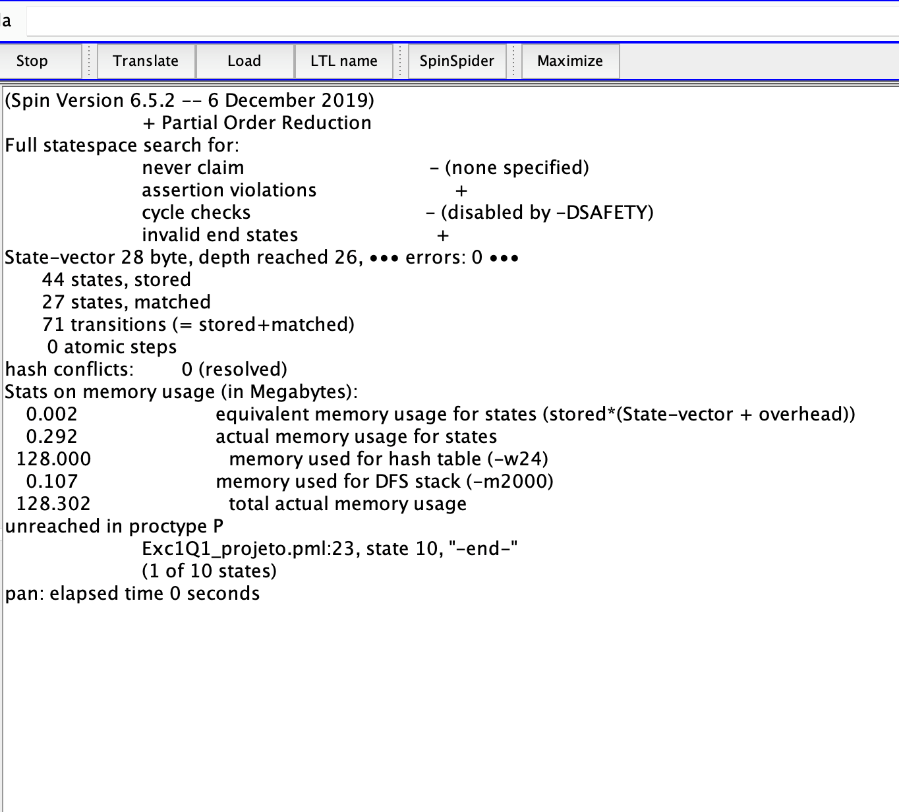
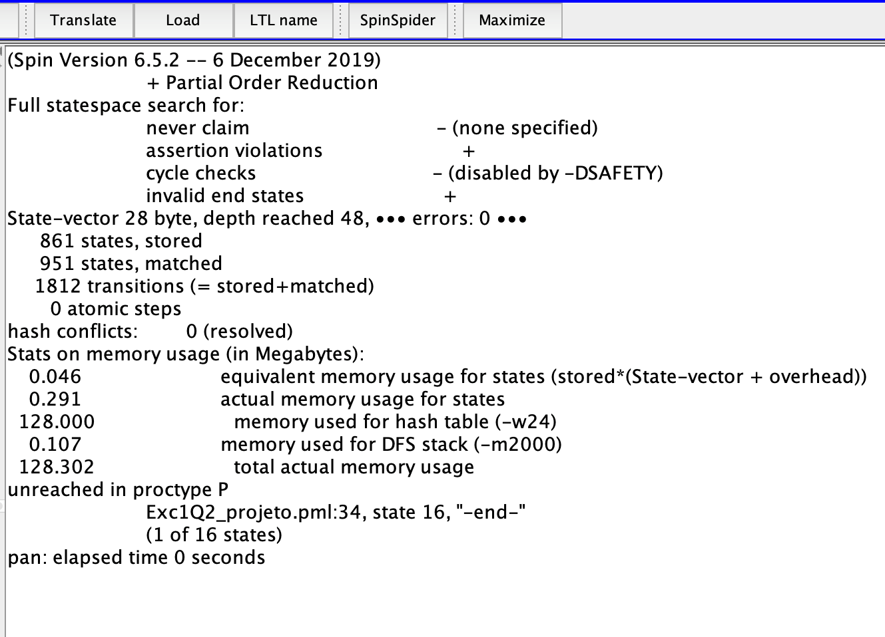
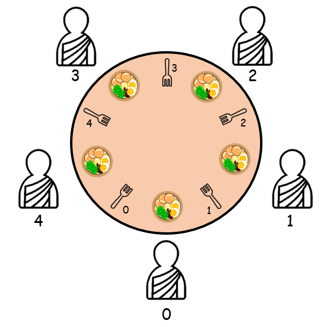
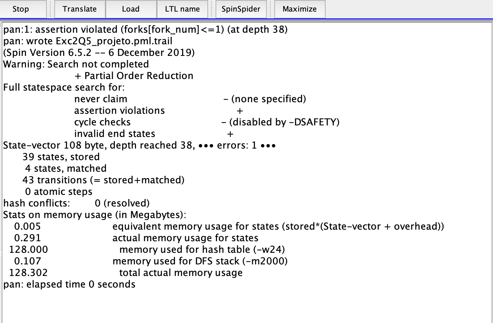
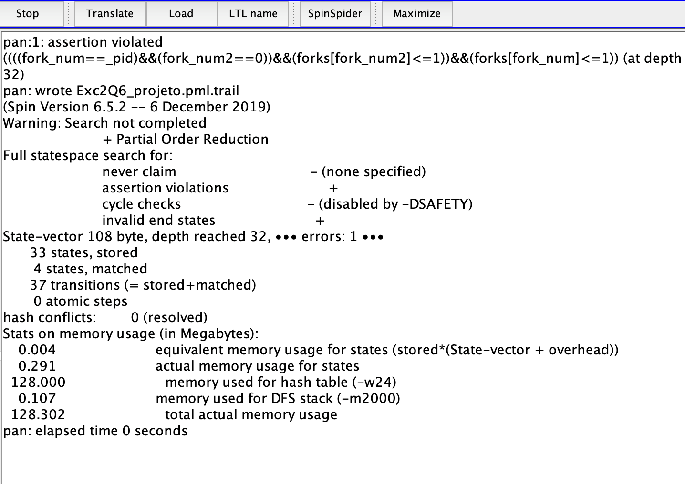
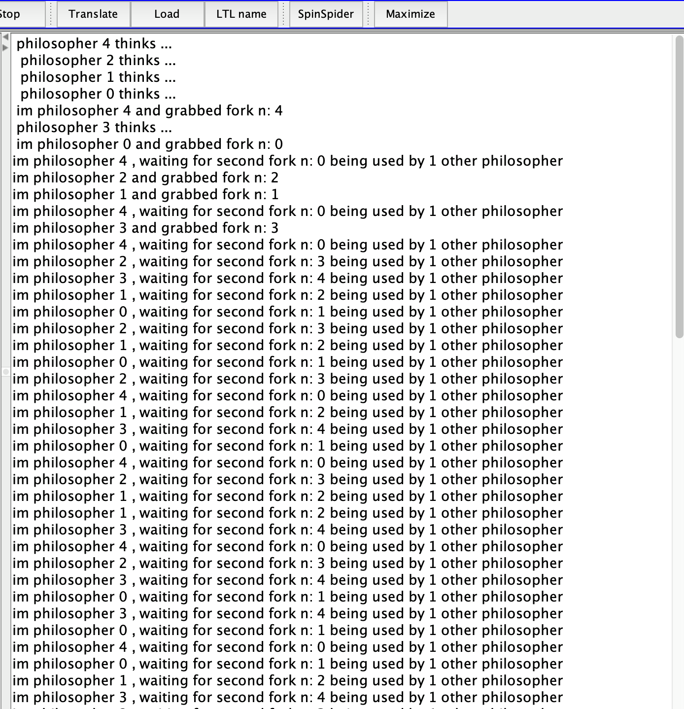
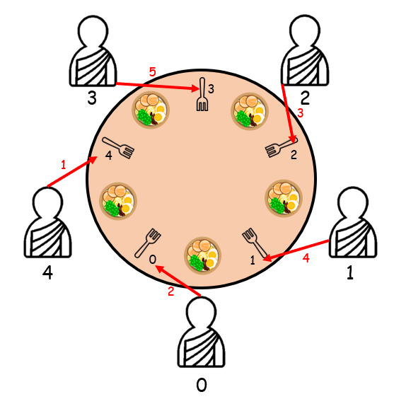
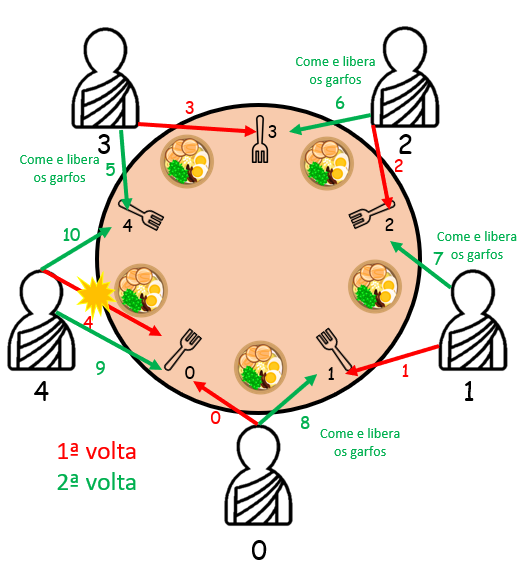
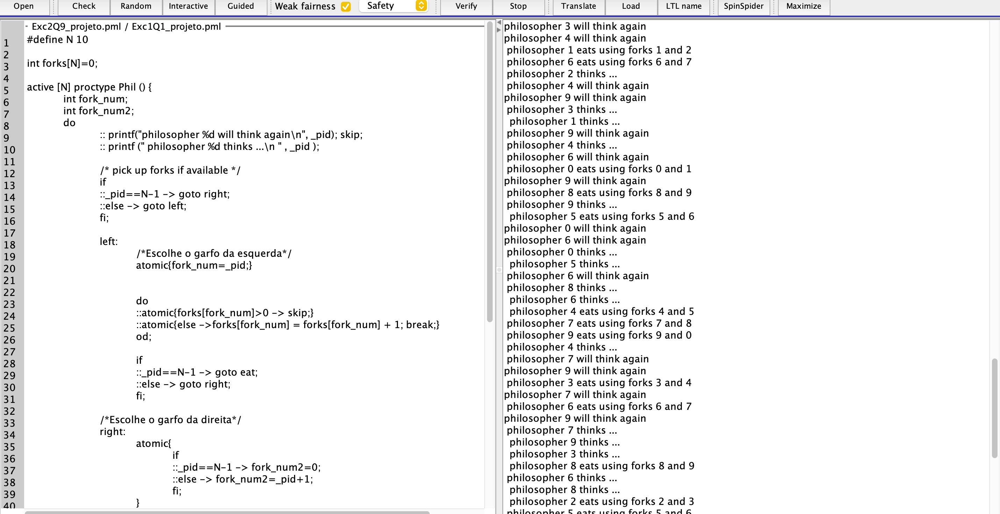

# Qualidade e Confiabilidade de Software 
# Assignment #1 – Verifying safety and liveness properties with SPIN 

Trabalho realizado por Carolina Godinho (PL1), Maria Carolina Gonçalves (PL1) e Maria Paula Viegas (PL1).

## 1- Problema da Secção Crítica 

Para este problema temos dois processos que estão repetidamente a tentar aceder a uma secção crítica e a uma secção não-crítica. A formulação geral do problema considera N ≥ 2 processos e considera a solução Peterson. 

### Pergunta 1 - [Exc1Q1_projeto.pml](Exc1Q1_projeto.pml)

A solução de Peterson para o problema da secção crítica utiliza um booleano para cada processo para sinalizar a vontade de entrar na secção crítica, e também usa uma variável binária para dar a vez de entrada ao processo nesta zona.  

Assim, para verificar se esta solução apresentava exclusão mútua, adicionámos uma variável global que conta o número de processos (**n_proc**) que entra e sai da região crítica. Ao se fazer uma asserção desta variável, **assert(n_proc==1)**, verificamos com o Spin, que esta solução evidentemente incluía a propriedade de exclusão mútua, visto que não foi apresentado nenhum erro. Assim concluimos que apenas um processo se encontra na região crítica de cada vez. 

### Pergunta 2 - [Exc1Q2_projeto.pml](Exc1Q2_projeto.pml)

Esta pergunta pede para dar a possibilidade de paragem aos processos por um tempo ilimitado fora da secção crítica.  

Deste modo, adicionámos uma função *wait* dentro de um ciclo *do* que utiliza uma sequência *atomic* para colocar os processos num estado de paragem.  

**inline wait() {
	atomic{ s>0 ; s--}
}**

Este ciclo do tem dois guards, um *wait* e um *break*. 

**do
		:: wait()
		:: break
od**

Sendo não determinístico, um processo pode: 

- Estar sempre em estado de *wait* ; 

- Estar sempre a sair do ciclo *break* para tentar aceder à região crítica; 

- Esperar um determinado tempo e de seguida tentar aceder à região crítica. 

### Pergunta 3 

Dentro dos problemas que envolvem uma secção crítica e exclusão mútua, surge quase sempre a mesma questão: **“Os processos estão livres de deadlock?”**. Num estado de *deadlock*, temos dois processos bloqueados, pois estão ambos à espera de poder utilizar o recurso que o outro processo está a utilizar. 

A partir da resolução das duas perguntas anteriores com a solução de *Peterson*, concluímos que não há *deadlocks*, pois não existe nenhum erro de ***Invalid End State*** ao fazer-se ***“Verify”*** no *SPIN*.  

Um erro de ***Invalid End State*** é considerado pelo sistema se terminar num estado onde nem todos os processos estão no final do seu código ou num estado local que está marcado com uma etiqueta de Final de Estado. 

Assim, se dois processos estivessem em *deadlock*, estes não estariam no final do seu código nem num estado final, visto que estariam à espera do outro processo para poder continuar. 

Adicionalmente, vemos também que não ocorre ***Time Out*** ao correr várias vezes a opção *"Random”*. 

## 2- Dining Philosophers Problem 

O famoso problema dos **Dining Philosophers** afirma que N filósofos silenciosos comem tigelas de esparguete numa mesa redonda. Entre cada par de filósofos existe um único garfo. Cada filósofo só come quando segura os garfos esquerdo e direito ao mesmo tempo. Cada filósofo alterna entre pensar e comer, e cada garfo só pode ser usado por um filósofo de cada vez. 

Este problema é usado para ilustrar problemas de sincronização entre processos em programas concorrentes.

### Pergunta 4 - [Exc2Q4_projeto.pml](Exc2Q4_projeto.pml)

Nesta pergunta é pedido para construir um modelo onde cada filósofo pode apenas comer quando segura nos dois garfos ao mesmo tempo. O filósofo deve pegar num garfo de cada vez, comer durante um tempo e colocar de volta os garfos na mesa um a seguir ao outro (e volta a pensar durante um tempo). Temos de ter em consideração que entre pegar o primeiro garfo e o segundo, outro filósofo pode executar outras ações. 

Para a resolução deste problema, começámos por definir que cada filósofo vai pegar primeiro no garfo esquerdo e depois vai pegar no garfo direito. Assim, os filósofos começam num estado pensativo e de seguida adquirem os garfos, um a um, para comer. Após ter os dois garfos e comer, este liberta os dois garfos, um de cada vez. 

Por exemplo escolher o garfo da esquerda:
**fork_num=_pid;	
forks[fork_num] = forks[fork_num] + 1;**

Libertar o garfo da esquerda:
**forks[fork_num] = forks[fork_num]-1;**

### Pergunta 5 - [Exc2Q5_projeto.pml](Exc2Q5_projeto.pml)

Para esta pergunta temos de verificar a seguinte propriedade:  

**"Nunca pode haver um único garfo a ser segurado por mais do que um filósofo simultaneamente.”**

Esta propriedade é o mesmo que verificar se o nosso modelo respeita a exclusão mútua. Para tal, fazemos uma asserção do *array* de garfos, e verificamos se algum garfo fica com o valor de 2, ou seja, se há dois filosofos a segurar o mesmo garfo. Com o *Spin* verificamos que o nosso modelo falha para esta propriedade indicando que existe um erro. 

Asserções:
- **assert(forks[fork_num] <= 1)**
- **assert(forks[fork_num2] <= 1)**

### Pergunta 6 - [Exc2Q6_projeto.pml](Exc2Q6_projeto.pml)

Na pergunta 6, é pedido para verificar se cada filósofo só come após segurar o garfo esquerdo e direito. Para conseguir avaliar esta propriedade, é necessário revelar que os filósofos são processos numerados com a variável de ***_pid*** e o garfo esquerdo do filosofo deve ser o garfo de número ***_pid*** assim como o garfo direito do filosofo deve ser o garfo de número ***_pid+1***. 

Ao fazer uma asserção dessas variáveis assim como uma asserção da exclusividade mútua com o *Spin*, verificamos que o modelo falha e apresenta um erro.  

Na asserção realizada para esta pergunta também é avaliado a propriedade de exclusividade mútua, visto que caso o filósofo estivesse a usar corretamente o seu garfo direito e esquerdo, se um desses garfos já estivesse a ser utilizado por outro filósofo, este garfo na realidade não ia estar disponível e tecnicamente ele não o estaria a usar, ou seja, era uma falsa realidade.

Asserções:

- **assert(fork_num == _pid && fork_num2 == _pid+1 && forks[fork_num2] <= 1 && forks[fork_num] <= 1)**
-  **assert(fork_num == _pid && fork_num2 == 0 && forks[fork_num2] <= 1 && forks[fork_num] <= 1)** (o garfo da direita do último processo não é _pid+1 mas sim o primeiro garfo )

### Pergunta 7 - [Exc2Q7_projeto.pml](Exc2Q7_projeto.pml)

A pergunta 7 é o modelo melhorado da pergunta 4 onde queremos que este respeite a propriedade de exclusão mútua. Ou seja, cada garfo só pode ser utilizado por um filósofo de cada vez.   

Para esta pergunta também foi sugerido utilizar sequências atómicas para pegar nos garfos individualmente. 

Assim comparando com o código da pergunta 4, adicionamos as sequencias atómicas, tanto ao escolher cada garfo e pegar no garfo, como ao libertar cada garfo usado. Finalmente, para respeitar a propriedade de exclusão mútua, foi criado um ciclo do onde o filósofo verificava se o garfo que está à espera já se encontra disponível.  

- Caso o garfo não esteja a ser usado, o filosofo sai do ciclo e vai tentar pegar no próximo garfo. Se já tem os dois garfos, vai comer.  

- Caso o garfo ainda não esteja disponível, este continua no ciclo do à espera da sua vez. 

No final, fizemos várias simulações, pequenas e longas, de modo a verificar se existia algum time out, o que não se verificou. 

Código exemplo, tentar pegar no garfo esquerdo:
**atomic{fork_num=_pid;}**

**do
   	::atomic{forks[fork_num]>0 -> skip;}
   	::atomic{else -> forks[fork_num] = forks[fork_num] + 1; break;}
od;**

### Pergunta 8 - [Exc2Q8_projeto.pml](Exc2Q8_projeto.pml)

Na questão, temos de verificar a seguinte propriedade, conhecida como ***deadlock freedom***: 

**"Alguns filósofos que estão a espera vão eventualmente comer."**

Inserimos alguns prints statements no estado de espera dos filósofos, de modo a perceber quais filósofos ficavam presos e em que situações isto acontecia. 

Vimos em algumas das nossas simulações que os filósofos ficam sempre a espera e nunca chegam a comer e assim falhando na propriedade de ***deadlock freedom***. 

Abaixo, encontra-se prints de uma simulação exemplo e seu respetivo desenho da situação de *deadlock*. 

Código exemplo dos prints statements no estado de espera para pegar no garfo esquerdo:
**do
	::atomic{forks[fork_num]>0 -> printf("im philosopher %d , waiting for fork n: %d being used by %d other philosopher\n",_pid,fork_num,forks[fork_num] );}
   	::atomic{else ->printf("im philosopher %d and grabbed fork n: %d\n",_pid,fork_num);forks[fork_num] = forks[fork_num] + 1;break;}
od;**

### Pergunta 9 - [Exc2Q9_projeto.pml](Exc2Q9_projeto.pml)

Vendo que o nosso modelo não respeita a propriedade de ***deadlock freedom***, tivemos que buscar uma nova solução para o problema dos filósofos. Primeiro, reutilizamos a ideia da questão 2 do trabalho, para que os filósofos não comessem sempre ao mesmo tempo. Com isso, as simulações mostraram melhores resultados, mas ainda assim havia casos com eventuais *deadlocks*. 

O ciclo do inicial tem dois *guards*, onde o processo pode pensar e de seguida prosseguir com querer comer, ou escolher a opção de voltar ao início do ciclo porque foi pensar outra vez visto que não quer comer.  

Sendo este do não determinístico, um processo pode: 

- Estar sempre a não querer comer; 

- Estar sempre querer comer; 

- Ou estar a alternar entre não comer e querer comer. 

Código exemplo do ciclo:
**do
		:: printf("philosopher %d will think again\n", _pid); skip;
		:: printf (" philosopher %d thinks ...\n " , _pid ); .......** (resto das operações de tentar pegar num garfo e comer)

Sendo o ciclo então não determinístico e existindo a possibilidade de todos os filósofos querem comer ao mesmo tempo, tivemos de arranjar uma forma de garantir ***deadlock freedom***. 

Até este ponto, todos os processos escolhiam sempre o garfo esquerdo primeiro e de seguida escolhiam o garfo direito. Contudo verificamos na pergunta 8, que esta implementação causava conflitos. 

Assim, após verificar vários exemplos na pergunta 8, foi possível chegar à conclusão que bastaria um processo alternar a ordem de pegar nos garfos, para não formar um ciclo de filósofos a espera e estes não ficarem todos em *deadlock*. 

Então, como ilustrado acima, enquanto o último filósofo da mesa pega primeiro no garfo direito e de seguida no garfo esquerdo, os outros pegam primeiro o esquerdo e depois o direito, evitando assim o *deadlock*. Para conseguir implementar isto, apenas se introduziu labels no código e condições if para redirecionar o último filósofo primeiro para o garfo direito, e depois para o garfo esquerdo. 

Código exemplo da decisão sobre qual é o primeiro garfo a tentar adquirir:
**if
    ::_pid==N-1 -> goto right;
    ::else -> goto left;
fi;**

### Pergunta 10 - [Exc2Q10_projeto.pml](Exc2Q10_projeto.pml)

Para esta pergunta, fazemos um teste final para nossa solução do problema dos filósofos **(questão 9)**. Reaplicamos os prints statements da **questão 8** para verificar *deadlocks*, e as asserções das **questões 5 e 6** para verificar se havia exclusões mútuas em diferentes simulações com diferentes condições (número de filósofos, máximo de steps e depth máxima) e confirmamos que nossa solução passa nos testes. 

**Testes**: 

- 5, 10 e 15 filósofos 

- 250, 500, 1000, 5000 passos.  

Em todos os testes realizados, não foram verificados quaisquer ***timeout*** ou falta de ***deadlock freedom***. O modelo também não falhou em nenhuma asserção o que indica que manteve a propriedade de exclusão mútua. 

Contudo, para garantir estas propriedades, alguns filósofos terão de esperar mais do que outros (***fairness problem***) ou podem nunca chegar a conseguir comer (***starvation problem***). Por exemplo, se tivermos 5 filósofos, e todos quiserem comer ao mesmo tempo, o último filósofo só vai conseguir comer quando todos os outros tiverem acabado e se o filosófo do seu lado esquerdo, que já comeu, não voltar a ter vontade de comer logo de seguida. Esta situação pode ser observada no esquema ilustrativo acima. Ou seja, em certos casos, alguns filósofos serão injustiçados de modo a garantir a existência destas propriedades mencionadas (**exclusão mútua e deadlock freedom**)